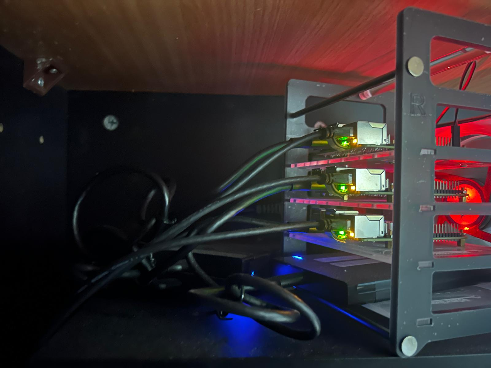

# Homelab Kubernetes Cluster (k3s)

  
  

## Overview
3-node k3s Kubernetes cluster running on Raspberry Pi 4.  
Built to learn GitOps, monitoring, and manage a production-like environment locally.

## Architecture
- 3 nodes (Raspberry Pi 4, 8GB RAM each).
- Each Pi runs on SSD instead of SD card.
- High Availability setup (embedded etcd).
- Kube-Vip as virtual IP and load balancer.  
- k3s lightweight Kubernetes distribution.  
- GitOps-based deployment model. 
- Self-managed Argo CD deployed via Helm.
- ksops + age for secret encryption and decryption. 
- External Raspberry Pi 5 running OpenMediaVault, hosting AdGuard Home as the DNS provider.

## Stack
- Kubernetes: k3s.  
- GitOps: Argo CD.  
- Ingress: Traefik (IngressRoute CRDs).  
- TLS: cert-manager (internal CA).  
- Monitoring: Prometheus + Grafana. (kube-prometheus-stack).  
- Database: CloudNativePG (PostgreSQL).  
- Dashboard: homepage as entry UI for the applications and services.  
- Automation: Renovate (dependency updates) and Reloader (auto-restart on config/secret changes).
- Additional apps: linkding, pgAdmin.
  

## GitOps Workflow
- Applications are deployed via Argo CD.
- Multi-source setup (Helm charts + custom values from repo and native Kubernetes manifests).
- Kustomize used for customization.
- Secrets managed with SOPS + ksops plugin.
- Argo CD configured with exec plugins for secret decryption. 

## Networking
- Internal domain: `*.home.lab`.  
- Ingress managed by Traefik.  
- TLS issued via cert-manager using internal ClusterIssuer.  
- Services and applications are exposed only within my home network, I chose not to expose them publicly.  

## Key Decisions
- Started with 3x Raspberry Pi 4 with 4GB of RAM cluster to learn Kubernetes hands-on.  
- Encountered RAM limitations (monitoring, database workloads).  
- Decided to upgrade the cluster to 3x Raspberry Pi 4 with 8GB of RAM.   
- Focused cluster usage on internal services and learning scenarios.  

## Issues & Solutions  
- **PostgreSQL authentication issue (CloudNativePG)**  
  → Superuser password not applied automatically  
  → Identified primary node and manually updated password  

- **Argo CD + ksops integration**  
  → Required custom initContainer + plugin setup  
  → Enabled secure secret management via SOPS  

## What I Learned
- GitOps workflows with Argo CD in real bare metal environments.
- Managing stateful workloads (PostgreSQL) in Kubernetes.  
- Debugging cluster-level issues (networking, auth, resources).  
- Trade-offs between “learning environments” and real production setups.  
- Not every problem requires Kubernetes (avoiding over-engineering).  

## Next Steps
- Migrate cluster to mini PCs (x86-64 architecture).  
- Improve resource management and stability.  
- Experiment with Flux CD as an alternative GitOps tool.
- Experiment with backup solusions, such as Velero with RustFS.
- Experiment with HashiCorp Vault for external secret management.
- Expand networking setup with VLAN isolation and firewall rules. 
